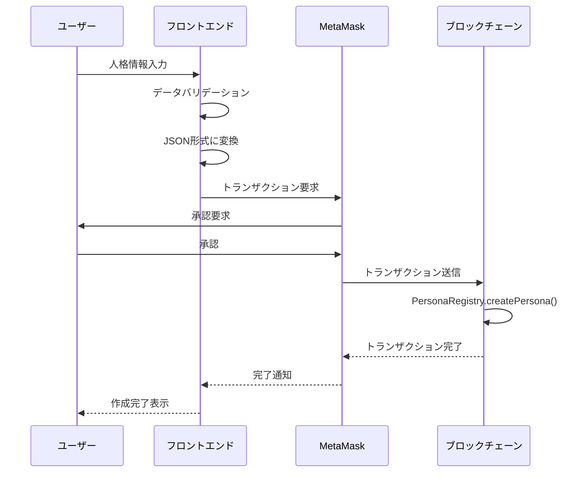
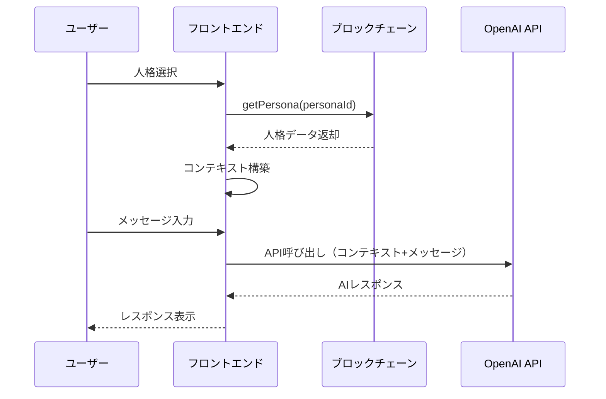

# 不老不死デジタル人格アプリ 技術設計書

## 1. システム概要

### 1.1 目的

ブロックチェーン技術を活用して永続的に保存されるデジタル人格と、OpenAI API を組み合わせた対話システムの実現。

### 1.2 システム特性

- **永続性**: ブロックチェーンによるデータの永続的保存
- **改ざん耐性**: 分散型台帳による改ざん不可能性
- **分散化**: 中央管理者不在のシステム
- **透明性**: オンチェーンデータの公開性

## 2. アーキテクチャ設計

### 2.1 システム構成図

```
┌─────────────────────────────────────────────────────────┐
│                     ユーザーブラウザ                        │
├─────────────────────────────────────────────────────────┤
│                   Next.js フロントエンド                    │
│  ┌──────────────┐  ┌──────────────┐  ┌──────────────┐  │
│  │   UI層       │  │  状態管理     │  │  API通信層    │  │
│  │  - Pages     │  │  - Context    │  │  - OpenAI    │  │
│  │  - Components│  │  - Hooks      │  │  - Blockchain │  │
│  └──────────────┘  └──────────────┘  └──────────────┘  │
└─────────────────────────────────────────────────────────┘
                    │                    │
                    ▼                    ▼
    ┌───────────────────────┐   ┌────────────────────┐
    │  Ethereum Blockchain  │   │    OpenAI API      │
    │  (Anvil Local Chain)  │   │   (GPT-4 Model)    │
    │  - PersonaRegistry    │   └────────────────────┘
    │  - データストレージ      │
    └───────────────────────┘
```

### 2.2 技術スタック詳細

#### フロントエンド

- **Framework**: Next.js 15.3.3 (App Router)
- **UI Library**: React 19.1.0
- **Styling**: CSS Modules / Tailwind CSS
- **Web3**:
  - wagmi 2.15.6 (Ethereum interactions)
  - viem 2.29.2 (TypeScript Ethereum library)
  - @rainbow-me/rainbowkit 2.2.8 (Wallet connection)
- **State Management**: React Context API + Custom Hooks
- **Type Safety**: TypeScript 5.5.4

#### ブロックチェーン

- **Network**: Anvil (Local Ethereum fork)
- **Smart Contract**: Solidity 0.8.x
- **Development Framework**: Foundry
- **Contract Testing**: Forge

## 3. スマートコントラクト設計

### 3.1 コントラクト構成

```solidity
// PersonaRegistry.sol
pragma solidity ^0.8.20;

contract PersonaRegistry {
    // 人格の基本情報
    struct BasicInfo {
        uint8 age;
        string occupation;
        string background;
    }

    // 人格の性格特性
    struct Personality {
        string traits;        // カンマ区切りの特徴
        string speakingStyle;
        string tone;
    }

    // 人格の知識・経験
    struct Knowledge {
        string expertise;     // カンマ区切りの専門分野
        string experiences;   // カンマ区切りの経験
        string memories;      // カンマ区切りの記憶
    }

    // 人格の価値観
    struct Values {
        string beliefs;       // カンマ区切りの信念
        string priorities;    // カンマ区切りの優先事項
    }

    // 完全な人格データ（オンチェーン保存）
    struct Persona {
        uint256 id;
        string name;
        BasicInfo basicInfo;
        Personality personality;
        Knowledge knowledge;
        Values values;
        address owner;
        uint256 createdAt;
        uint256 updatedAt;
        bool isActive;
    }

    // Storage
    uint256 private nextPersonaId = 1;
    mapping(uint256 => Persona) public personas;
    mapping(address => uint256[]) public userPersonas;

    // Events
    event PersonaCreated(uint256 indexed personaId, address indexed owner, string name);
    event PersonaUpdated(uint256 indexed personaId, string name);
    event PersonaTransferred(uint256 indexed personaId, address from, address to);
    event PersonaDeactivated(uint256 indexed personaId);
}
```

### 3.2 主要関数

| 関数名                    | 説明                                       | アクセス制御   |
| ------------------------- | ------------------------------------------ | -------------- |
| `createPersona`           | 新規人格作成（全データをオンチェーン保存） | 任意のユーザー |
| `updatePersona`           | 人格データ更新（部分更新可能）             | 所有者のみ     |
| `getPersona`              | 人格データ取得（構造体全体を返却）         | パブリック     |
| `getPersonaDetails`       | 人格の詳細データを個別に取得               | パブリック     |
| `listUserPersonas`        | ユーザーの人格 ID 一覧取得                 | パブリック     |
| `getUserPersonasWithData` | ユーザーの全人格データ取得                 | パブリック     |
| `transferPersona`         | 人格の所有権移転                           | 所有者のみ     |
| `deactivatePersona`       | 人格の無効化（削除ではなくフラグ管理）     | 所有者のみ     |

### 3.3 オンチェーン保存の実装詳細

#### 関数実装例

```solidity
function createPersona(
    string memory _name,
    uint8 _age,
    string memory _occupation,
    string memory _background,
    string memory _traits,
    string memory _speakingStyle,
    string memory _tone,
    string memory _expertise,
    string memory _experiences,
    string memory _memories,
    string memory _beliefs,
    string memory _priorities
) public returns (uint256) {
    uint256 personaId = nextPersonaId++;

    Persona storage newPersona = personas[personaId];
    newPersona.id = personaId;
    newPersona.name = _name;

    // 基本情報
    newPersona.basicInfo.age = _age;
    newPersona.basicInfo.occupation = _occupation;
    newPersona.basicInfo.background = _background;

    // 性格
    newPersona.personality.traits = _traits;
    newPersona.personality.speakingStyle = _speakingStyle;
    newPersona.personality.tone = _tone;

    // 知識
    newPersona.knowledge.expertise = _expertise;
    newPersona.knowledge.experiences = _experiences;
    newPersona.knowledge.memories = _memories;

    // 価値観
    newPersona.values.beliefs = _beliefs;
    newPersona.values.priorities = _priorities;

    // メタデータ
    newPersona.owner = msg.sender;
    newPersona.createdAt = block.timestamp;
    newPersona.updatedAt = block.timestamp;
    newPersona.isActive = true;

    userPersonas[msg.sender].push(personaId);

    emit PersonaCreated(personaId, msg.sender, _name);

    return personaId;
}
```

#### ガス最適化戦略

1. **ストレージパッキング**:

   - `uint8`を使用して年齢を保存（uint256 の代わりに）
   - `bool`と`address`を同じスロットに配置

2. **文字列の効率化**:

   - 配列の代わりにカンマ区切り文字列を使用
   - フロントエンドで分割・結合処理

3. **読み取り最適化**:
   - 個別フィールド取得関数の提供
   - 必要なデータのみを取得可能

**オンチェーン保存のメリット**:

- **完全な分散化**: 外部サービスへの依存なし
- **永続性保証**: ブロックチェーンが存在する限りデータが保持
- **透明性**: すべてのデータが公開検証可能
- **シンプルな実装**: IPFS 等の追加インフラ不要

**考慮事項**:

- **ガス代**: デモ環境（Anvil）では無料、本番環境では要検討
- **プライバシー**: すべてのデータが公開される
- **ストレージ制限**: 極端に長いテキストは分割保存が必要

## 4. フロントエンド設計

### 4.1 ページ構成

```
src/app/
├── page.tsx                 # ホーム（人格一覧）
├── layout.tsx               # 共通レイアウト
├── providers.tsx            # Context Providers
├── personas/
│   ├── create/
│   │   └── page.tsx        # 人格作成
│   └── [id]/
│       ├── page.tsx        # 人格詳細・チャット
│       └── edit/
│           └── page.tsx    # 人格編集
└── components/
    ├── Layout/
    │   ├── Header.tsx      # ヘッダー（ウォレット接続）
    │   └── Footer.tsx
    ├── Persona/
    │   ├── PersonaForm.tsx # 人格作成・編集フォーム
    │   ├── PersonaCard.tsx # 人格カード表示
    │   └── PersonaList.tsx # 人格一覧
    ├── Chat/
    │   ├── ChatInterface.tsx  # チャットUI
    │   ├── MessageList.tsx    # メッセージ表示
    │   └── MessageInput.tsx   # 入力フィールド
    └── Web3/
        └── ConnectButton.tsx   # ウォレット接続ボタン
```

### 4.2 状態管理設計

```typescript
// Context構成
interface AppState {
  // Web3関連
  account: string | null;
  chainId: number | null;
  isConnected: boolean;

  // 人格関連
  personas: Persona[];
  selectedPersona: Persona | null;
  isLoadingPersonas: boolean;

  // チャット関連
  messages: Message[];
  isGenerating: boolean;
}

// Custom Hooks
usePersona(); // 人格データの取得・更新
useChat(); // チャット機能
useContract(); // スマートコントラクト操作
useOpenAI(); // OpenAI API連携
```

### 4.3 コンポーネント設計詳細

#### PersonaForm コンポーネント

```typescript
interface PersonaFormProps {
  mode: 'create' | 'edit';
  initialData?: PersonaData;
  onSubmit: (data: PersonaData) => Promise<void>;
}

// フィールド構成
- 基本情報セクション（名前、年齢、職業、背景）
- 性格セクション（特徴、話し方、口調）
- 知識セクション（専門分野、経験、記憶）
- 価値観セクション（信念、優先事項）
```

#### ChatInterface コンポーネント

```typescript
interface ChatInterfaceProps {
  persona: Persona;
  onSendMessage: (message: string) => Promise<void>;
}

// 機能
-リアルタイムメッセージ表示 -
  タイピングインジケーター -
  メッセージ履歴のスクロール -
  エラーハンドリング;
```

## 5. データフロー詳細

### 5.1 人格作成フロー



### 5.2 チャット対話フロー



## 6. API 設計

### 6.1 OpenAI API 統合

```typescript
interface ChatRequest {
  model: "gpt-4" | "gpt-3.5-turbo";
  messages: [
    {
      role: "system";
      content: string; // 人格コンテキスト
    },
    {
      role: "user";
      content: string; // ユーザーメッセージ
    }
  ];
  temperature: number; // 0.7 推奨
  max_tokens: number; // 応答の最大長
}
```

### 6.2 システムプロンプト構築

```typescript
function buildSystemPrompt(persona: PersonaData): string {
  return `
あなたは「${persona.name}」という人格です。

【基本情報】
- 年齢: ${persona.basic_info.age}
- 職業: ${persona.basic_info.occupation}
- 背景: ${persona.basic_info.background}

【性格特徴】
${persona.personality.traits.join(", ")}

【話し方】
- スタイル: ${persona.personality.speaking_style}
- 口調: ${persona.personality.tone}

【知識・経験】
- 専門分野: ${persona.knowledge.expertise.join(", ")}
- 重要な経験: ${persona.knowledge.experiences.join(", ")}
- 記憶: ${persona.knowledge.memories.join(", ")}

【価値観】
- 信念: ${persona.values.beliefs.join(", ")}
- 優先事項: ${persona.values.priorities.join(", ")}

上記の人格設定に基づいて、一貫性のある応答をしてください。
`;
}
```

## 7. セキュリティ設計

### 7.1 フロントエンドセキュリティ

- **API キー管理**:

  - 環境変数での管理（NEXT_PUBLIC_OPENAI_API_KEY）
  - プロダクション環境ではプロキシサーバー経由を推奨

- **入力検証**:

  - XSS 対策: 全ユーザー入力のサニタイズ
  - 文字数制限の実装

- **CSP (Content Security Policy)**:
  ```typescript
  // next.config.js
  const securityHeaders = [
    {
      key: "Content-Security-Policy",
      value:
        "default-src 'self'; script-src 'self' 'unsafe-eval'; connect-src 'self' https://api.openai.com",
    },
  ];
  ```

### 7.2 スマートコントラクトセキュリティ

- **アクセス制御**:

  - onlyOwner 修飾子の実装
  - 人格データの所有者確認

- **データ検証**:
  - 入力データサイズの制限
  - 不正な文字列の検証

## 8. 開発環境セットアップ

### 8.1 必要なツール

```bash
# Node.js環境
node >= 20.0.0
pnpm >= 10.16.0

# ブロックチェーン開発
foundry (forge, cast, anvil)

# 環境変数
NEXT_PUBLIC_OPENAI_API_KEY=your_api_key
NEXT_PUBLIC_WALLET_CONNECT_PROJECT_ID=your_project_id
```

### 8.2 ローカル開発フロー

1. **Anvil の起動**

   ```bash
   cd packages/contract
   anvil
   ```

2. **コントラクトのデプロイ**

   ```bash
   forge script script/PersonaRegistry.s.sol --rpc-url http://localhost:8545 --broadcast
   ```

3. **フロントエンドの起動**
   ```bash
   cd packages/frontend
   pnpm dev
   ```

## 9. テスト戦略

### 9.1 スマートコントラクトテスト

```solidity
// test/PersonaRegistry.t.sol
contract PersonaRegistryTest is Test {
    function testCreatePersona() public {
        // 人格作成のテスト
    }

    function testUpdatePersona() public {
        // 人格更新のテスト
    }

    function testOwnershipTransfer() public {
        // 所有権移転のテスト
    }
}
```

### 9.2 フロントエンドテスト

```typescript
// コンポーネントテスト
describe("PersonaForm", () => {
  it("should validate required fields", () => {});
  it("should submit valid data", () => {});
});

// 統合テスト
describe("Chat Flow", () => {
  it("should load persona and enable chat", () => {});
  it("should send message and receive response", () => {});
});
```

## 10. デプロイメント設計

### 10.1 デモ環境（Anvil）

```bash
# ローカル環境での実行
anvil --host 0.0.0.0

# フロントエンドの環境変数
NEXT_PUBLIC_RPC_URL=http://localhost:8545
NEXT_PUBLIC_CHAIN_ID=31337
```

### 11.2 本番環境考慮事項

- **スマートコントラクト**:

  - Ethereum メインネットへのデプロイ
  - コントラクトの検証（Etherscan）
  - アップグレード戦略の検討

- **フロントエンド**:
  - Vercel でのホスティング
  - CDN の活用
  - 環境変数の管理

## 12. 監視とロギング

### 12.1 アプリケーション監視

```typescript
// エラートラッキング
interface ErrorLog {
  timestamp: Date;
  errorType: "CONTRACT" | "API" | "UI";
  message: string;
  stack?: string;
  userAddress?: string;
}
```

### 12.2 メトリクス収集

- トランザクション成功率
- API 応答時間
- ユーザーセッション時間
- 人格作成数

## 13. 今後の拡張可能性

### 13.1 機能拡張

- **IPFS 統合**: 大容量データの分散保存
- **NFT 化**: 人格の NFT トークン化
- **マルチチェーン対応**: 複数ブロックチェーンへの展開
- **音声対話**: 音声入出力機能の追加

### 13.2 技術的改善

- **Layer 2 対応**: ガス代削減のための L2 統合
- **プライバシー強化**: ゼロ知識証明の活用
- **AI 改善**: ファインチューニングモデルの使用

## 14. リスクと対策

| リスク             | 影響度 | 対策                         |
| ------------------ | ------ | ---------------------------- |
| API キー漏洩       | 高     | サーバーサイドプロキシの実装 |
| ガス代高騰         | 中     | L2 ソリューションの採用      |
| OpenAI API ダウン  | 中     | フォールバック機能の実装     |
| データ永続性の誤解 | 低     | 明確な説明と UI 表示         |

## 15. 用語集

- **デジタル人格**: AI が模倣する個人の性格・知識・価値観の集合
- **オンチェーン**: ブロックチェーン上に直接保存されるデータ
- **ガス代**: Ethereum ネットワークでの取引手数料
- **スマートコントラクト**: ブロックチェーン上で実行される自動化されたプログラム
- **ウォレット**: 暗号資産とブロックチェーンアプリケーションへのアクセスを管理するツール
